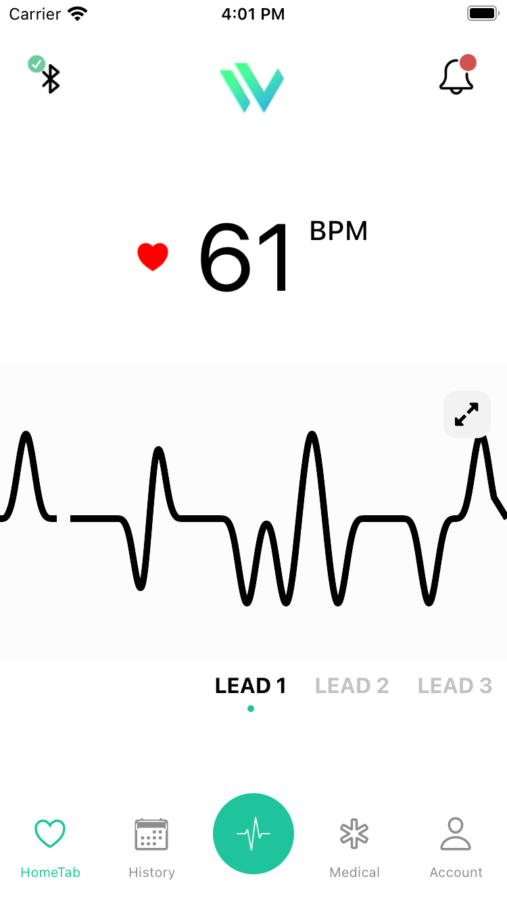

<!-- language-all: javascript -->

<center><p>

</p><p>
</center>

# Heart-Care

https://github.com/yousef-zeiad/HeartCare.git

React-native iOS / Android app

---


[](https://github.com/prettier/prettier) 
## Table of Contents

- [Assets](#assets)
  - [images](#images)
- [Scripts](#scripts)
  - [yarn pod-install](#yarn-pod-install)
  - [yarn start](#yarn-start)
  - [yarn ios](#yarn-ios)
  - [yarn android](#yarn-android)
- [Integrations:](#integrations-)
  - [Expo](#expo)
  - [Styled Components](#styled-components)
  - [React-Native-Shared-Element](#react-native-shared-element)
  -  [React-Native-Navigation](#react-native-navigation)
  -   [React-Native-animated-charts](#react-native-@rainbow-me/animated-charts)
- [Components](#components)
  - [Header](#header)
  - [HeartRatingChart](#heart-rating-chart)
- [Environment](#environment)
  - [Git](#git)
  - [Node](#node)
  - [Yarn](#yarn)
  - [Visual Studio Code](#visual-studio-code)
- [Upgrade React-Native](#upgrade-react-native)
- [Environment Variables](#environment-variables)

<small><i><a href='http://ecotrust-canada.github.io/markdown-toc/'>Table of contents generated with markdown-toc</a></i></small>

# Assets

Custom assets are used with license and available in the [assets](./assets) folder.

## images

Common images used by the app. In root you'll find app icon, splash etc.

### App First Screen
<center><p>

</p><p>
</center>

# Structure

Describes the app structure and usage of each part. Add additional ReadMe-files in each folder as needed and link them here.

- [assets](./assets) - place any images and fonts here
- [components](./components) - see **[Components](#Components)** section
- [config](./config) - global config files
- [screens](./features) - main app code divided by feature. A screens folder contains all the screens, components, etc for that feature.
- [navigation](./navigation/ReadMe.md) - [react-navigation](https://reactnavigation.org/) implementation.

<!-- ## yarn pod

Update and install iOS pods. Run after cloning or adding a native module.

## yarn pod-install

As above but with repo update if any pod is out of date, such when you update an NPM package with native modules. -->

## yarn start

Start the React-Native packager. You can optionally

- **`yarn clear`** to start and reset cache of the bundler.


## yarn ios

Like `npm start`, but also attempts to open your app in the iOS Simulator if you're on a Mac and have it installed.

Runs the simulator named `iPhone SE (2nd generation)` which we consider most stable.

<!-- There's a couple of scripts that runs a specific device:

- **`yarn ios-device`** - runs default device which can be a physical one (see "Run on device" above)
- **`yarn ios-bundle`**: bundle JS for release
- **`yarn ios-release`**: run on device in Relase mode (requires release cert)
- **`yarn iosx`**: run on iPhone X (11.4)
- **`yarn ios-schemes`**: list available schemes and products -->

## yarn android

Like `npm start`, but also attempts to open your app on a connected Android device or emulator. Requires an installation of Android build tools (see [React Native docs](https://facebook.github.io/react-native/docs/getting-started.html) for detailed setup).

<!--
- **[Android Release Build](#android-release-build)**
- **`yarn android-build`**: bundle relase AAB
- **`yarn android-beta`**: fastlane upload to beta
- **`yarn android-release`**: builds the app in release mode, bundling all JS so it can run on a device without an active bundler. Ensure the app runs in release before PR.
- **`yarn android-signing`**: generate the signing report, so you can retrieve SHA-1 hash etc.
- **`yarn android-reverse`**: runs `adb reverse` so the connected device can find the bundler. -->

# Integrations:

## Expo

The app is built using [Expo](https://docs.expo.io/) for React-Native. It allows working with JavaScript without native code and instant releases Over The Air (OTA). The commands (above) uses Expo to start, run, build and deploy the app.

- [app.json](./app.json) - Expo config
- [expo-shared](./.expo-shared/README.md) - shared Expo config for all developers

## Styled Components

Project uses Styled components v5.3.0 for RN to make the styles
read more:

- https://styled-components.com/docs

## React-Native-Shared-Element

This library solves that problem through an all native implementation which is very close to the metal of the OS. It solves the problem by providing a set of "primitives",
Read more:

- [react-native-shared-element](https://github.com/IjzerenHein/react-native-shared-element)

## React-Native-animated-charts

This library solves that problem through an all native implementation which is very close to the metal of the OS. It solves the problem by providing a set of "primitives",
Read more:

- [react-native-@rainbow-me/animated-charts](https://github.com/rainbow-me/react-native-animated-charts)

Read more:

- https://github.com/rainbow-me/react-native-animated-charts

# Components

The design uses different components depending on the type of data. Here's a reference to what component to use when.

## Header 

A Main header for all the screen that take the icons and a children as a prop

```typescript
import { Header } from '../../components/Header';

	return (<Header isIcon={false}>
        <HeartRates height={false}
         marginBottom={false}
         fontSize={false} />
      </Header>
);
```

## HeartRatingChart
A Nice Chart Handler that you can use in more screens and take the dynamic height and width.

```typescript

import { HeartRatingChart } from '../../components/HeartRatingChart';
  return (
            <HeartRatingChart
              item={item}
              size={Layout.window.width}
              points={points}
              key={index}
             />
           );

``` 

# Environment

## Git

We're using latest stable. Install the version for your OS from:

**[https://git-scm.com/downloads](https://git-scm.com/downloads 'Download Git')**

## Node

These versions provides stable compatibility with React Native and other frameworks:

- **Node v12.XX** (`node --version`)
- **npm 6.XX** (`npm --version`)

**[Download Node with NPM](https://nodejs.org/download/release/v12.16.3/)**

## Yarn

We install and run our scripts with yarn, as an alternative to npm:

**[Download Yarn](https://yarnpkg.com/lang/en/docs/install/)**

## Visual Studio Code

We use Visual Studio Code with relevant plugins.

- **[React-Native Tools](https://marketplace.visualstudio.com/items?itemName=msjsdiag.vscode-react-native)**
- **[Prettier](https://marketplace.visualstudio.com/items?itemName=esbenp.prettier-vscode)**
- **[TypeScript Hero](https://marketplace.visualstudio.com/items?itemName=rbbit.typescript-hero)**
- **[TypeScript importer](https://marketplace.visualstudio.com/items?itemName=pmneo.tsimporter)**
- **[TypeScript toolbox](https://marketplace.visualstudio.com/items?itemName=DSKWRK.vscode-generate-getter-setter)**
- **[Add jsdoc comments](https://marketplace.visualstudio.com/items?itemName=stevencl.addDocComments)**
- **[Expo Tools](https://marketplace.visualstudio.com/items?itemName=byCedric.vscode-expo)**
- **[GitHub](https://marketplace.visualstudio.com/items?itemName=KnisterPeter.vscode-github)**
- **[Styled Components](https://marketplace.visualstudio.com/items?itemName=jpoissonnier.vscode-styled-components)**
- **[ES7 React/Redux/GraphQL/React-Native snippets](https://marketplace.visualstudio.com/items?itemName=dsznajder.es7-react-js-snippets)**
- **[Tabnine Autocomplete AI: autocompletion smart code](https://marketplace.visualstudio.com/items?itemName=TabNine.tabnine-vscode)**

# Upgrade React-Native

For a native project. Expo projects follows Expo version and upgrade guide.

> npx react-native upgrade

https://reactnative.dev/docs/upgrading#react-native-cli
https://react-native-community.github.io/upgrade-helper/

# Environment Variables

You can configure some of Create React Native App's behavior using environment variables.
